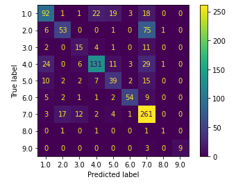

# Redefining Cancer Treatment
Este projeto faz parte do projeto faz parte do curso de Machine Learning da Formação Cientista de Dados da Data Science Academy.
Dados disponíveis em: https://www.kaggle.com/c/msk-redefining-cancer-treatment/data

## Importação e estruturação dos dados:
Os dados foram baixados diretamente do Kaggle no endereço mostrado acima.
Foram utilizados apenas os arquivos training_texts e training_variants, porque os arquivos de teste do Kaggle não são etiquetados, servindo apenas para submissão na referida competição, que não é o escopo deste trabalho. Os arquivos não foram incluídos neste repositório por limitação de espaço do GitHub.
Foi feita a estruturação dos dados em um arquivo unificado no formato .json para carga posterior.
Manipulação pode ser vista no notebook 00-importacao_e_estruturacao.ipynb

## Atenção: todos os arquivos intermediários necessários para execução deste projeto são gerados pelos próprios noteboos dentro da pasta data_files. Estes arquivos intermediários não foram carregados no repositório por restrições do github quanto ao tamanho dos arquivos.

## Análise exploratória de dados:
Feita no notebook 01-Analise_exploratoria_de_dados.ipynb, a partir do .json salvo na etapa anterior.

## Processamento de linguagem natural:
Foram aplicadas técnicas de processamento de linguagem natural aos dados estruturados nas etapas anteriores.
As seguintes técnicas foram executadas ao dataset, na seguinte ordem: tokeninzação, remoção das stopwords e pontuações, stemming e lematização, e cálculo do TF-IDF para montar uma matriz para treinamento dos modelos de ML.
O resultado foi gravado em um .json para carregamento na etapa seguinte.
Tratamento dado aos textos está no notebook 02-TF_IDF.ipynb.

## Limpeza de dados:
A seguir, foi realizada uma limpeza de dados, com tratamento dos valores NA's gerados na etapa anterior e uma normalização dos dados para entrada no treinamento dos modelos. Os dados foram divididos em datasets de treino e teste e salvos em arquivos .csv.
Esta etapa está no notebook 03-Limpeza_de_dados.ipynb.

## Balanceamento de classes e tratamento de matriz esparsa:
Devido ao desbalanceamento das classes do dataset de treino, se fez necessário um balanceamento de classes por oversampling, através da técnica SMOTE. Devido ao tamanho das matrizes geradas, foi conveniente que fossem gravadas como matrizes esparsas para evitar estouro de memória da máquina local. Os processamentos desta etapa estão em 04-Balanceamento_de_classes.ipynb.

## Redução de dimensionalidade:
Por causa do elevado número de colunas da matriz gerada, foi testada uma redução de dimensionalidade antes do treinamento dos modelos de machine learning através do método PCA, conforme visto no notebook 05-Reducao_dimensionalidade.ipynb. Posteriormente, tal redução mostrou-se ineficaz no treinamento dos modelos utilizados.

## Treinamento dos modelos de Machine Learning:
A partir desta etapa, os processamentos foram feitos na nuvem em notebooks do Google Colab, devido a restrições de hardware da máquina local. Se fez necessário adaptar o endereço dos arquivos a serem carregados, como é mostrado nos notebooks.
Foram utilizados modelos do scikit-learng, seguindo inicialmente as recomendações mostradas no mapa abaixo:

Inicialmente foram utilizados datasets com dimensionalidade reduzida, mas o desempenho ficou aquém do esperado e esta possibilidade foi abandonada.
Foram testados os seguintes modelos: LinearSVC, Naive-Bayes, KNNClassifier e RandomForestClassifier.
**O modelo RandomForestClassifier apresentou o melhor desempenho, com acurácia de 65,7%.**
O treinamento dos modelos pode ser visualizado nos seguintes notebooks:
- 06-Treinamento_modelos_ML-1.ipynb
- 06-Treinamento_modelos_ML-2.ipynb
- 06-Treinamento_modelos_ML-3.ipynb
- 07-Treinamento_modelos_ML-4.ipynb
- 08-Treinamento_modelos_ML-5.ipynb

Abaixo pode-se ver a matriz de confusão do modelo treinado:

## Conclusões e melhorias futuras
Conclui-se este projeto com a finalização dos modelos de machine learning, atingindo uma acurácia de 65,7% atingida pelo modelo Random Forest. Considera-se que, para fins didáticos, foi atingido um bom percentual de acerto para o modelo de ML. Obviamente, ainda há grandes oportunidades de melhoria, que não serão implementadas no momento devido a limitações de tempo e restrições de hardware na máquina local. Oportunidades de melhoria a serem exploradas:
- Desenvolver o projeto inteiramente na nuvem, em uma máquina virtual que seja capaz de levar o dataset de treinamento completo até o treinamento dos modelos de machine learning;
- Melhorar o tratamento de texto inicial, de modo a eliminar numerais e possíveis palavras que ficaram unidas indevidamente;
- Utilização de mais modelos de machine learning, como por exemplo, redes neurais profundas. Neste caso, seria ideal a utilização de uma máquina com GPU para treinamento da rede.
